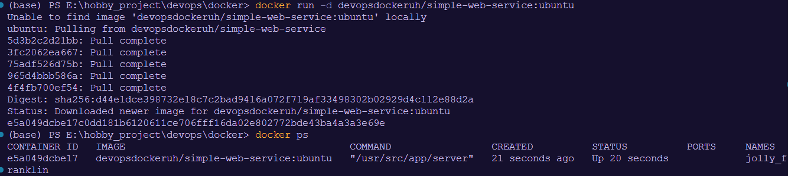
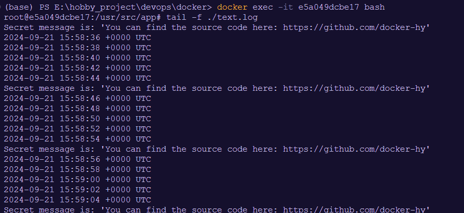

## 1. Start container from image

```
docker run -d devopsdockeruh/simple-web-service:ubuntu
docker ps
```



## 2. Go inside the running container and use tail -f ./text.log to follow the logs

### Go inside the running container

```
docker exec -it e5a049dcbe17 bash
```

### Tracking Logs

```
tail -f ./text.log
```



## 3. Secret Message:

`Secret message is: 'You can find the source code here: https://github.com/docker-hy'`
