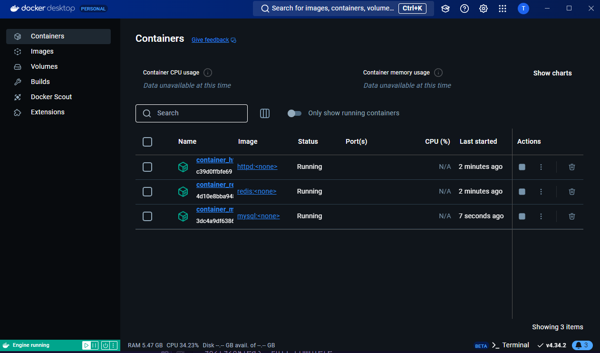
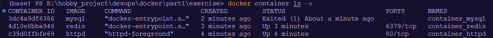
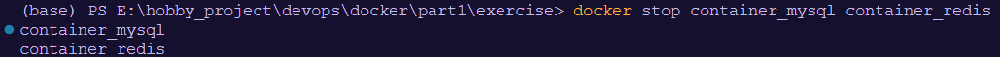
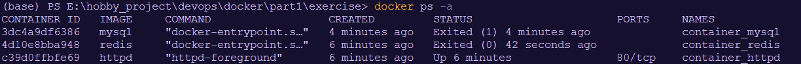

1. Start 3 containers from an image that does not automatically exit (such as nginx) in detached mode.

```
docker run -d --name container_httpd httpd
docker run -d --name container_redis redis
docker run -d --name container_mysql mysql
```




2. Stop two of the containers and leave one container running.

```
docker stop container_mysql container_redis
```



3. Submit the output for docker ps -a which shows 2 stopped containers and one running.
   
