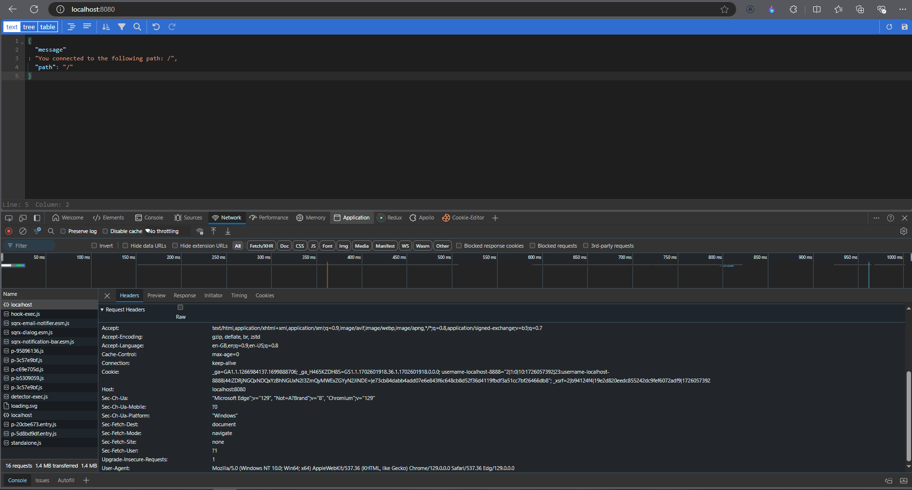

```
docker build . -t web-server
```

```
docker run -p 8080:8080 web-server
```

The image devopsdockeruh/simple-web-service will start a web service in container's port 8080.



```
docker run -d -it -p 8000:8080 --name port-mapping devopsdockeruh/simple-web-service sh -c 'server'
```
