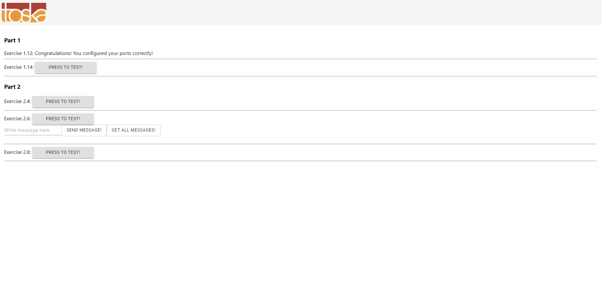

# 1.12

### 1. Navigate to example-frontend folder

```
cd example-frontend
```

### 2. Run the command to build an image from docker file and run this image as a container

```
docker build . -t frontend-example && docker run -p 5000:5000 frontend-example
```

### 3. Navigate to http://localhost:5000/



# 1.14
