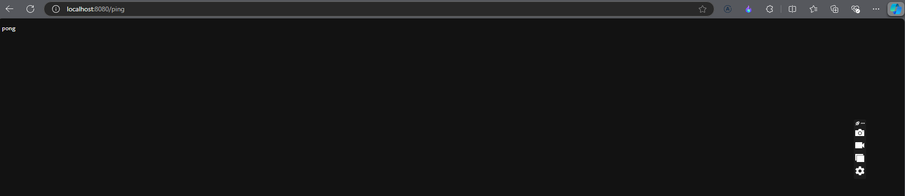
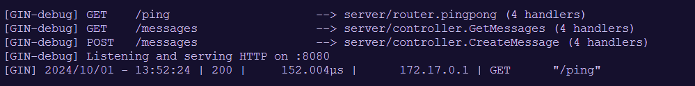

# 1.13

### 1. Navigate to the example-backend folder:

```
cd example-backend
```

### 2. Run command to build docker image and run docker container

```
$ docker build . -t backend-example && docker run -p 8080:8080 backend-example
```

### 3. Access to http://localhost:8080/ping



