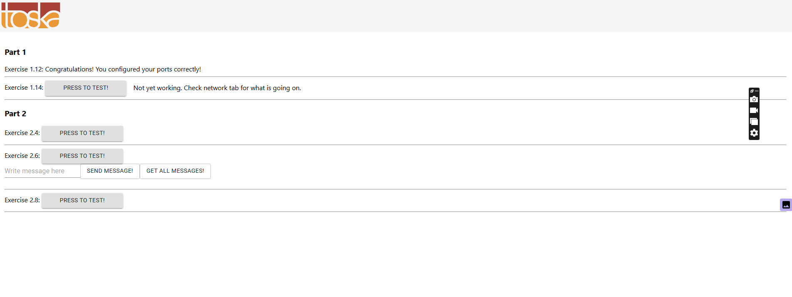
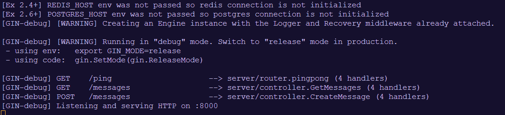
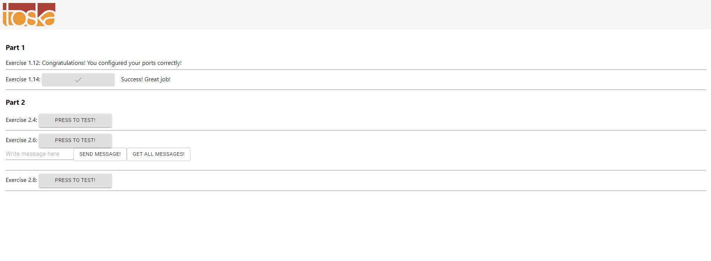

# 1.14

## 1. Navigate to example-frontend folder and open a terminal

```
cd example-frontend
```

## 2. Run the command to build an image and run container for frontend

```
docker build . -t frontend-example && docker run -p 5000:5000 frontend-example
```

## 3. Test the front end

- access to [localhost](http://localhost:5000/)
- Click the PRESS TO TEST button of exercise 1.14:




## 4. Navigate to example-backend folder, open another terminal

```
cd example-backend
```

## 5. Run the command to build an image and run container for backend

```
$ docker build . -t backend-example && docker run -p 8000:8000 backend-example
```



## 6. Re-test the frontend button:


