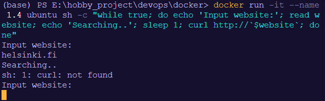
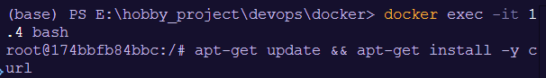
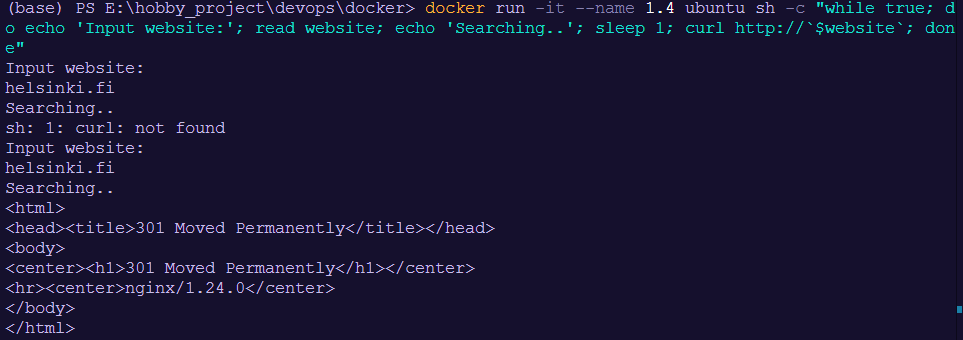

## 1. Start a Ubuntu image:

```
docker run -it --name 1.4 ubuntu sh -c "while true; do echo 'Input website:'; read website; echo 'Searching..'; sleep 1; curl http://`$website`; done" 
```



## 2. Install curl:

- Open another terminal and type the command to execute the ubuntu container

```
docker exec -it 1.4 bash
```

- Install curl to the ubuntu container

```
apt-get update && apt-get install -y curl
```



## 3. Wait for install curl finish and then recheck with the Input website helsinki.fi:
