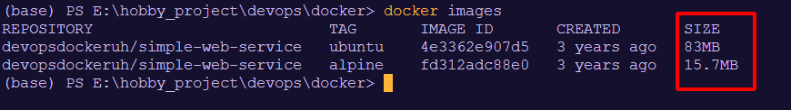
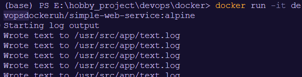
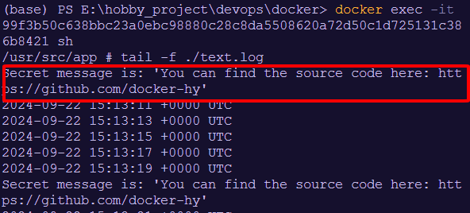

## 1. Pull images

```
docker pull devopsdockeruh/simple-web-service:ubuntu
docker pull devopsdockeruh/simple-web-service:alpine
```

## 2. Compare the image sizes

```
docker images
```



- The Ubuntu image will usually be larger in size because it includes more tools and libraries.
- The Alpine image is smaller because it only includes the most essential components.

## 3. Run the container from the Alpine image with sh

### Run the container from the Docker image
```
docker run -it devopsdockeruh/simple-web-service:alpine
```



### Execute the docker container
```
docker exec -it 
99f3b50c638bbc23a0ebc98880c28c8da5508620a72d50c1d725131c386b8421 sh
```

### Check the secret message


-> Wow, the same message as 1.3!!! :D