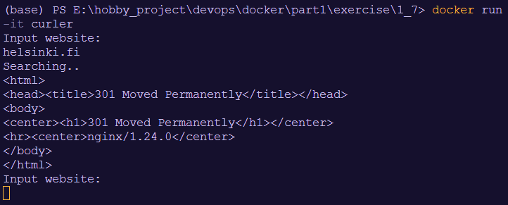

## 1. Build the Docker image from the Dockerfile and named it "curler"

```
docker build -t curler .
```

## 2. Run the Docker container

```
docker run -it curler
```



## 3. Flexible option:
```
docker build -t curler-v2 .
docker run curl-v2 helsinki.fi
```
