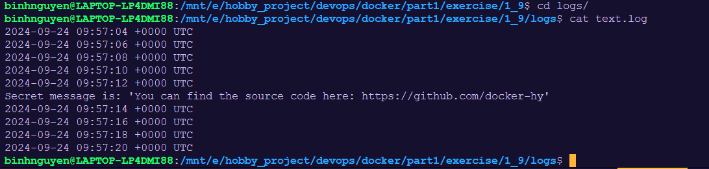
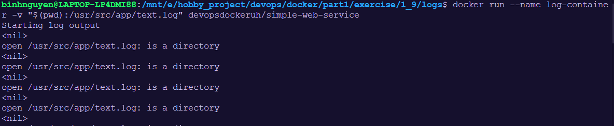

## 1. Find the path of the current directory:

```
pwd
```

=> Path: /mnt/e/hobby_project/devops/docker/part1/exercise/1_9

## 2. Create text.log file

```
$mkdir logs
$cd logs
$touch text.log
```

## 3. Run container with --mount

```
$docker run --mount type=bind,source=/mnt/e/hobby_project/devops/docker/part1/exercise/1_9/logs/text.log,destination=/usr/src/app/text.log devopsdockeruh/simple-web-service
```


## 4. Using -v to bind mount
```
$ docker run --name log-container -v "$(pwd):/usr/src/app/text.log" devopsdockeruh/simple-web-service
```

