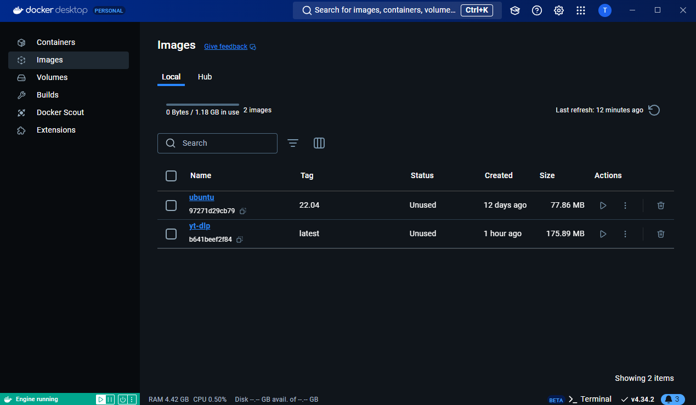
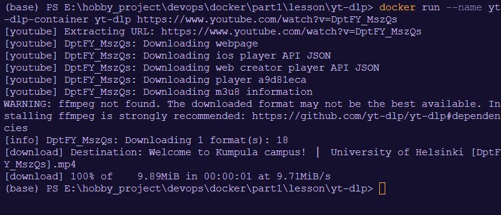
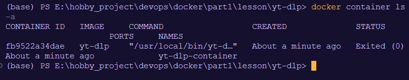
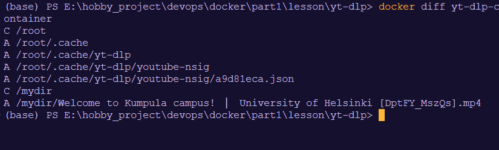

## 1. Build Docker image:

```
docker build -t yt-dlp .
```



## 2. Run the container from the docker image with argument as another youtube URL

```
docker run --name yt-dlp-container yt-dlp https://www.youtube.com/watch?v=DptFY_MszQs
```



## 3. See container ls

```
docker container ls -a
```



## 4. inspect changes to the filesystem of a Docker container

```
docker diff yt-dlp-container
```


A: A file or directory was added.
D: A file or directory was deleted.
C: A file or directory was changed.

## 5. Copy the downloaded video to the local machine

```
docker cp "yt-dlp-container://mydir/Welcome to Kumpula campus! | University of Helsinki [DptFY_MszQs].mp4" .
```
